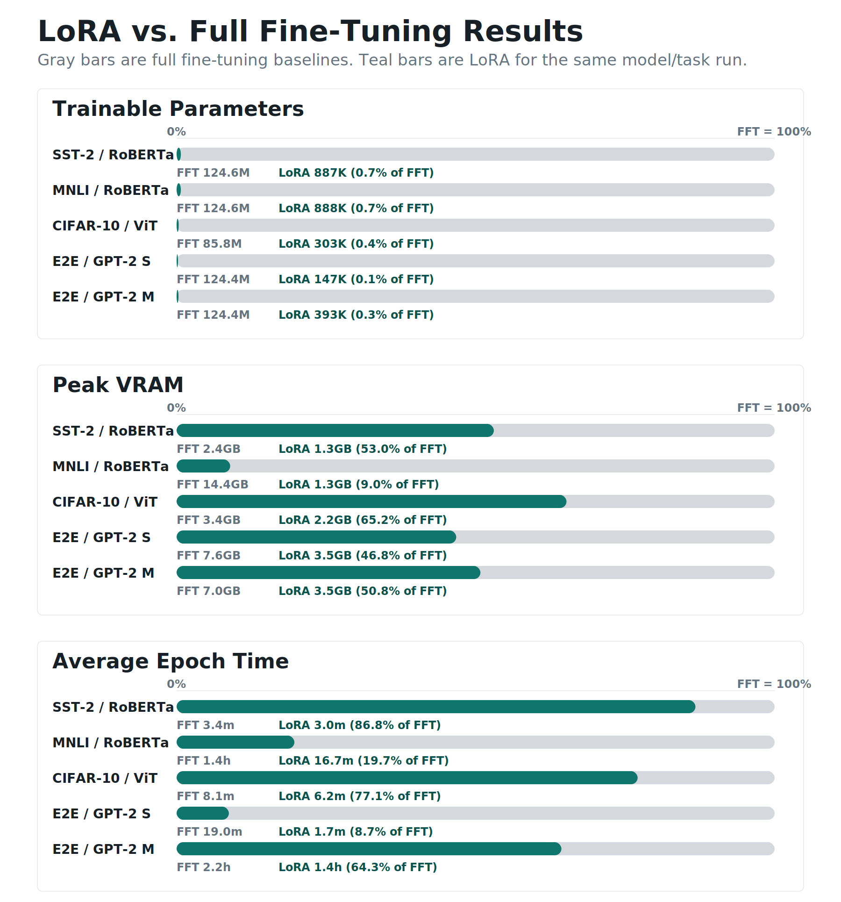
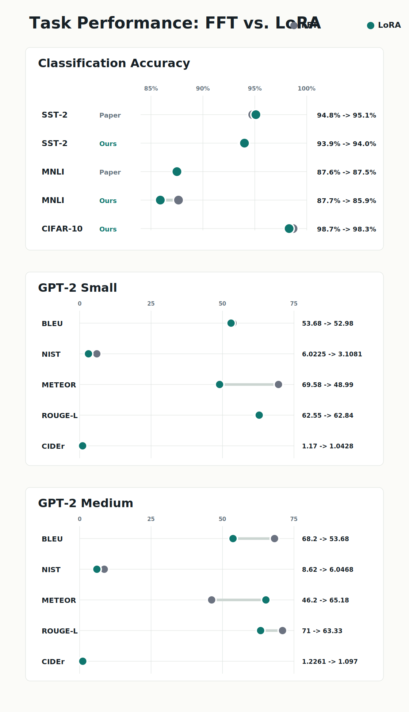

# Re-Implementation of LoRA: Low-Rank Adaptation of Large Language Models

This repository contains a from-scratch re-implementation of the methods proposed in [LoRA: Low-Rank Adaptation of Large Language Models](https://arxiv.org/abs/2106.09685) (Hu et al., 2021). The project was completed as the final deliverable for CS 4782 (Probabilistic Models and Deep Learning) at Cornell University.

LoRA's core idea is to freeze the pre-trained model weights and inject trainable low-rank decomposition matrices into transformer layers. During the forward pass, the output becomes **h = W₀x + BAx**, where only the small matrices A and B are trained. This reduces trainable parameters by over 99% while preserving competitive downstream performance. We verify these claims across NLU, NLG, and vision tasks, and extend LoRA to Vision Transformers as a novel experiment.

## Chosen Result

We aimed to reproduce the paper's central claim: LoRA matches full fine-tuning (FFT) accuracy on GLUE benchmarks and E2E generation while dramatically reducing trainable parameters, VRAM usage, and training time. We specifically targeted:

- **Table 2 (RoBERTa):** Classification accuracy on SST-2 and MNLI with ~0.3M trainable parameters vs. ~125M for FFT
- **Table 5 (GPT-2 Medium):** NLG metrics (BLEU, NIST, METEOR, ROUGE-L, CIDEr) on the E2E dataset

| | Original Paper (Table 5) | |
|---|---|---|
| **Model & Method** | **BLEU** | **ROUGE-L** |
| GPT-2 M (FT) | 68.2 | 71.0 |
| GPT-2 M (LoRA) | 70.4 | 71.8 |

As an independent extension, we also tested LoRA on **ViT-B/16 for CIFAR-10 classification** to evaluate whether the method generalizes beyond language models.

## GitHub Contents

```
├── code/                   # All model and training code
│   ├── lora/               # LoRA implementation (layers, injection, config)
│   ├── training/           # Trainer classes (GLUE, ViT)
│   ├── eval/               # Evaluation and metric utilities
│   ├── train.py            # Entry point: RoBERTa on GLUE tasks
│   ├── train_vit.py        # Entry point: ViT on CIFAR-10
│   ├── gpt2_fft.py         # GPT-2 full fine-tuning on E2E
│   └── gpt2_lora.py        # GPT-2 LoRA fine-tuning on E2E
├── data/                   # Dataset loading utilities (GLUE, E2E, CIFAR)
├── results/                # Generated figures and result visualizations
│   └── scripts/            # Scripts to regenerate result figures
├── poster/                 # Academic poster PDF
├── report/                 # 2-page project summary report
├── requirements.txt        # Python dependencies
└── LICENSE                 # MIT License
```

## Re-implementation Details

**LoRA Module:** We implemented a `LoRALinear` wrapper that takes an existing `nn.Linear`, freezes its weights, and adds two trainable matrices: A ∈ ℝ^(r×k) (initialized with Kaiming uniform) and B ∈ ℝ^(d×r) (initialized to zero). The forward pass computes `base_out + (B @ A @ x) * (α/r)`. An injection script walks the model tree and replaces layers matching target module names (default: `query` and `value` attention projections).

**Models and Datasets:**
| Model | Task | Dataset | Hardware |
|---|---|---|---|
| RoBERTa-base | Classification | SST-2, MNLI (GLUE) | A100, L4 |
| GPT-2 Small / Medium | Generation | E2E NLG | T4 |
| ViT-B/16 | Classification | CIFAR-10 | T4 |

**Key Challenges:**
- Hugging Face's GPT-2 fuses Q, K, V into a single `c_attn` layer. We wrote a custom forward hook to apply LoRA deltas to the Q and V slices separately, then concatenate them back.
- Due to compute constraints, we used GPT-2 Small/Medium instead of the paper's Medium/Large, with adjusted hyperparameters (r=4 α=32 for Medium; r=8 α=32 for Small).
- We found that applying dropout on the LoRA path degraded GPT-2 performance, so we report results without it.

**Evaluation Metrics:** Accuracy for classification tasks; BLEU, NIST, METEOR, ROUGE-L, and CIDEr for generation (computed via HuggingFace `evaluate`, NLTK, and `pycocoevalcap`).

## Reproduction Steps

**1. Clone and install dependencies:**
```bash
git clone https://github.com/Ajay-T/Re-implementation-of-LoRA.git
cd Re-implementation-of-LoRA
pip install -r requirements.txt
```

**2. RoBERTa on GLUE (classification):**
```bash
cd code

# LoRA
python train.py --model_name roberta-base --task sst2 --mode lora --r 8 --alpha 8 --epochs 30 --fp16

# Full fine-tuning
python train.py --model_name roberta-base --task sst2 --mode full --epochs 30 --fp16
```

**3. ViT on CIFAR-10 (classification):**
```bash
cd code

# LoRA
python train_vit.py --dataset cifar10 --mode lora --r 8 --epochs 10 --fp16

# Full fine-tuning
python train_vit.py --dataset cifar10 --mode full --epochs 10 --fp16
```

**4. GPT-2 on E2E (generation):**

The GPT-2 scripts (`gpt2_lora.py` and `gpt2_fft.py`) are self-contained notebook-style files. They were run in Google Colab with T4 GPUs. To run locally:
```bash
cd code
python gpt2_lora.py    # LoRA fine-tuning
python gpt2_fft.py     # Full fine-tuning
```

**5. Regenerate result figures:**
```bash
python results/scripts/generate_results_graphic.py
python results/scripts/generate_performance_graphic.py
python results/scripts/generate_summary_table.py
python results/scripts/generate_efficiency_scatter.py
python results/scripts/generate_param_reduction.py
python results/scripts/generate_nlg_metrics.py
```

**Compute Requirements:** All experiments were run on Google Colab with T4 or A100 GPUs. RoBERTa and ViT experiments complete in under an hour; GPT-2 Medium FFT requires ~2 hours on a T4.

## Results / Insights

**Parameter and Compute Efficiency:**

LoRA reduced trainable parameters by over 99% in every experiment. Peak VRAM dropped by up to 91% (MNLI) and epoch times decreased by up to 91% (GPT-2 Small).



**Task Performance:**

| Model | Metric | Paper (FFT) | Ours (FFT) | Paper (LoRA) | Ours (LoRA) |
|---|---|---|---|---|---|
| ViT / CIFAR-10 | Accuracy | — | 98.68 | — | 98.30 |
| RoBERTa / SST-2 | Accuracy | 94.8 | 93.9 | 95.1 | 94.0 |
| RoBERTa / MNLI | Accuracy | 87.6 | 87.7 | 87.5 | 85.9 |
| GPT-2 Med / E2E | BLEU | 68.2 | 54.11 | 70.4 | 53.68 |
| GPT-2 Med / E2E | METEOR | 46.2 | 69.10 | 46.8 | 65.18 |
| GPT-2 Med / E2E | ROUGE-L | 71.0 | 62.03 | 71.8 | 63.33 |

- **Classification tasks** (SST-2, CIFAR-10): LoRA nearly matches FFT accuracy while training <1% of parameters. Our ViT extension confirms LoRA generalizes to vision.
- **MNLI**: Minor accuracy drop with LoRA, but overall comparable to FFT.
- **E2E generation**: Absolute scores differ from the paper (likely due to smaller model scale, different METEOR implementations, and hyperparameter sensitivity), but the gap between FFT and LoRA remains small — supporting the paper's central claim.



## Conclusion

Our re-implementation validates LoRA's core premise: many downstream tasks have a low intrinsic dimension and do not require updating all pre-trained parameters. Across five experiment configurations, LoRA consistently reduced trainable parameters by 99%+, VRAM by up to 91%, and training time by up to 91%, with minimal accuracy loss on classification tasks. The GPT-2 generation results highlight that NLG tasks are more sensitive to hyperparameter tuning and rank selection, but the relative FFT-to-LoRA gap remains small. Our ViT extension demonstrates that LoRA is not limited to language — it generalizes effectively to vision transformers.

## References

1. Hu, E. J., Shen, Y., Wallis, P., Allen-Zhu, Z., Li, Y., Wang, S., & Chen, W. (2021). *LoRA: Low-Rank Adaptation of Large Language Models.* arXiv:2106.09685.
2. Liu, Y., et al. (2019). *RoBERTa: A Robustly Optimized BERT Pretraining Approach.* arXiv:1907.11692.
3. Radford, A., et al. (2019). *Language Models are Unsupervised Multitask Learners.* OpenAI.
4. Dosovitskiy, A., et al. (2020). *An Image is Worth 16x16 Words: Transformers for Image Recognition at Scale.* arXiv:2010.11929.
5. [E2E NLG Dataset](https://github.com/tuetschek/e2e-dataset) — Novikova, J., Dušek, O., & Rieser, V. (2017).
6. [GLUE Benchmark](https://gluebenchmark.com/) — Wang, A., et al. (2018).
7. [Hugging Face Transformers](https://github.com/huggingface/transformers) — Wolf, T., et al. (2020).
8. [PyTorch](https://pytorch.org/) — Paszke, A., et al. (2019).

## Acknowledgements

This project was completed as the final deliverable for **CS 4782: Probabilistic Models and Deep Learning** at Cornell University (Spring 2026). We thank the course staff for their guidance and feedback throughout the project. Training was conducted on Google Colab using T4 and A100 GPUs.
